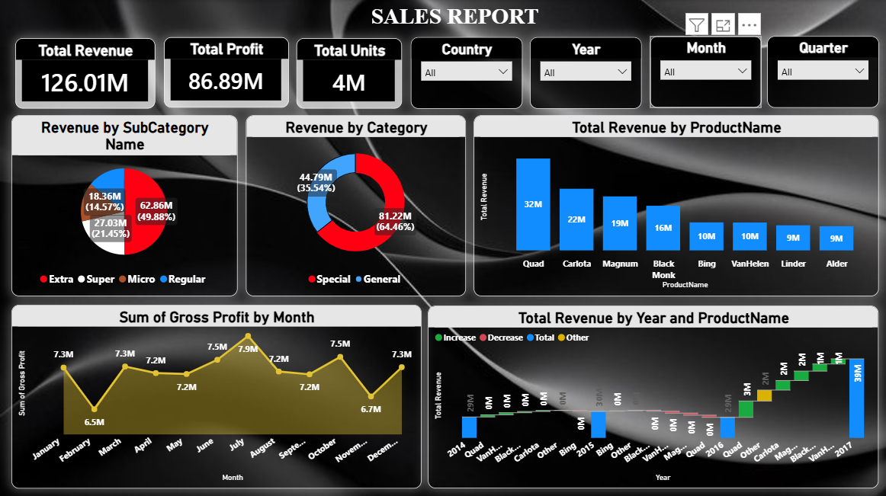

# Sales Dashboard

## Overview
This Power BI dashboard provides comprehensive insights into sales performance, revenue generation, profitability, and product trends across multiple business dimensions. The dashboard enables stakeholders to monitor key performance indicators, analyze sales patterns, and support data-driven business decisions.

## Key Metrics
- Total Revenue: 126.01M
- Total Profit: 86.89M
- Total Units Sold: 4M

## Features
- Revenue analysis by category and sub-category
- Product-wise revenue performance analysis
- Monthly gross profit trend analysis
- Country-wise sales analysis
- Year, Month, and Quarter filtering
- Revenue trend monitoring
- Product performance comparison
- Interactive business intelligence reporting

## Tools Used
- Power BI
- DAX
- Data Modeling
- Data Visualization

## Business Insights
- Revenue distribution varied significantly across product categories and sub-categories.
- Top-performing products contributed a substantial share of overall revenue.
- Monthly gross profit trends highlighted seasonal business fluctuations.
- Product-level analysis enabled identification of high-performing products.
- Interactive filters provided detailed insights across different countries and time periods.
